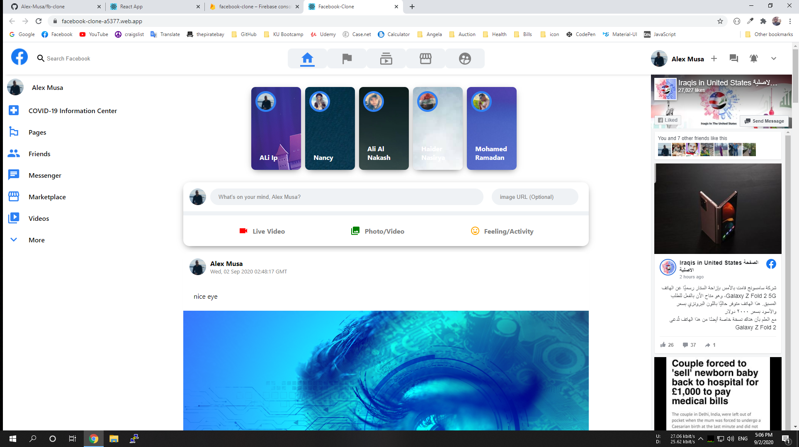

<h1>Netflix Clone app</h1>

<h2>What is it?</h2>
A Facebook app created with React used Material-UI & Firebase

<h2>Built With</h2>
<ul>
  <li>React</li>
  <li>Yarn</li>
  <li>CSS</li>
  <li>Material-UI</li>
  <li>Firebase</li>
  
</ul>

<h2>Check it out!</h2>
https://facebook-clone-a5377.web.app/
